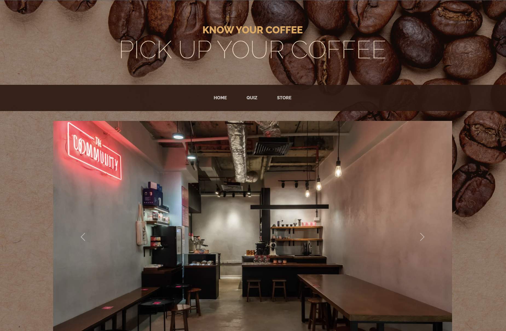

## SECTION 1 : PROJECT TITLE
## Intelligent Specialty Coffee Recommender

---

## SECTION 2 : EXECUTIVE SUMMARY / PAPER ABSTRACT
In these years, coffee has become one of the most important things to modern people, serving as both a social and functional staple in everyone’s daily life. The rise of coffee culture, the influence of globalization, the numerous health benefits associated with moderate coffee consumption.

From a data-driven perspective, the growing importance of coffee in modern society can be observed through several indicators. These include the increasing number of coffee consumers, the rising consumption per capita, the growth of the coffee industry, and the expanding market for specialty coffee.

The growth of the coffee industry and expanding specialty coffee market are strong indicators for a healthy coffee growth. Overall, these data-driven insights underscore the growing importance of coffee in contemporary society, as people continue to embrace it as a vital part of their daily routines, social lives and culinary adventures.
After studying that the world of coffee continues to grow in both variety and complexity, it becomes increasingly challenging for consumers to navigate the vast landscape of options and discover their personal preferences. Therefore, this coffee recommendation system idea came out. We want to design a coffee recommendation system that offers a solution to solve the ‘Choosing best coffee’ problem by leveraging advanced algorithms and data analysis to curate personalized coffee suggestions tailored to individual tastes and preferences. This innovative approach can not only enhance the coffee experience for the customers, but also drive engagement and customer loyalty for coffee retailers and subscription services.

---

## SECTION 3 : CREDITS / PROJECT CONTRIBUTION

| Official Full Name  | Student ID (MTech Applicable)  | Work Items (Who Did What) | Email (Optional) |
| :------------ |:---------------:| :-----| :-----|
| Jingyi Zhang | A0269366M | Ideation, Data Collection, Data Preprocessing, Data feature extraction, Recommendation algorithm design  | e1112237@u.nus.edu |
| Lin Ji | A0269369H | Ideation, Data Collection, Data Preprocessing, Data feature extraction, Recommendation algorithm design, Video Editing | e1112240@u.nus.edu |
| HuiWen Tang | A0269361X | UI/UX Design, Data Preprocessing, Recommendation algorithm design | e1112232@u.nus.edu |
| Li Gengwei | A0269362W | Ideation, Data Collection, Data Preprocessing, Data feature extraction, Recommendation algorithm design | e1112233@u.nus.edu |
| Fong Zhi En Kelvin | A0269365N | Data Preprocessing, Frontend Dev, Backend Dev, Code Integration | e1112236@u.nus.edu |

---

## SECTION 4 : VIDEO OF SYSTEM MODELLING & USE CASE DEMO

---

## SECTION 5 : USER GUIDE

### [ 1 ] To run the Backend
### Using any Ubuntu based environment, or Ubuntu on WSL on Windows 

> $ pip install jupyter_kernel_gateway

> Navigate to "BackEnd" folder

> $ jupyter kernelgateway --KernelGatewayApp.api='kernel_gateway.notebook_http' --KernelGatewayApp.seed_uri='Backend.ipynb' --KernelGatewayApp.port=8899

### [ 2 ] To run the Frontend

> pip install flask

> Navigate to "\FrontEnd\KnowYourCoffee" Folder

> $ python main.py

> **Go to URL using web browser** http://0.0.0.0:5000 or http://127.0.0.1:5000

---
## SECTION 6 : PROJECT REPORT / PAPER

**Recommended Sections for Project Report / Paper:**
- Introduction
- Business Case
  - Problem Statement
  - Market Research
  - Insdustry Overview
  - Industry Overview
  - Consumer Trends
  - Competitive Landscape
  - AI-Based Recommendation Systems in Retail
  - Consumer Acceptance of AI-Based Systems
  - Conclusion
  - Proposed Solution
- Knowledge Representation
  - Coffee Flavor Categorization Rule
  - Introduction to Coffee Cupping Notes
- Data collection and preprocessing
- Recommender System Design
  - System Architecture Overview
  - Frontend Design
  - Backend Design
  - System Algorithm
  - Frontend and Backend Integration
  - System Validation
- Coffee Recommender System Commercial Values
  - Advantages of System
  - Limitations of System
  - Future Outlook
- Conclusion
- References
- Appendix
  - Appendix A: Project proposal
  - Appendix B: Individual report

---
## SECTION 7 : MISCELLANEOUS

---

